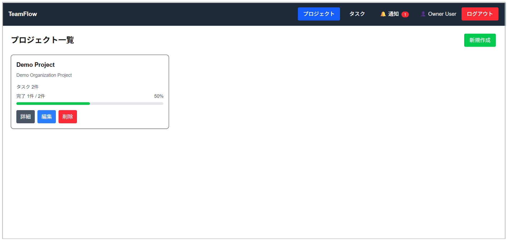
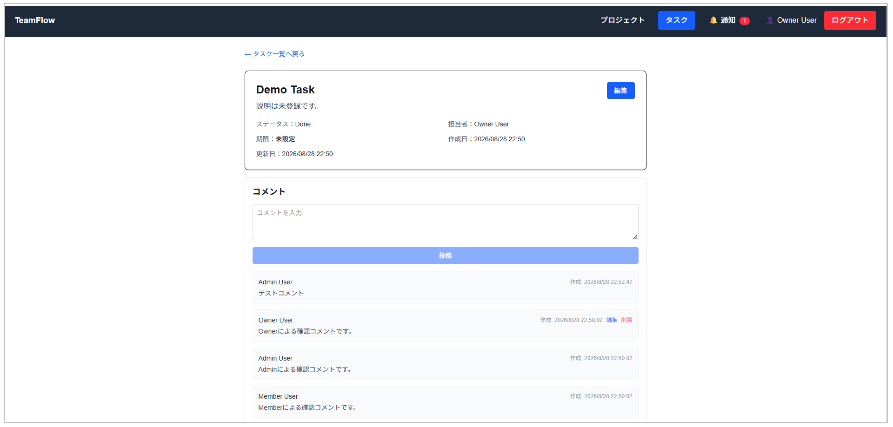
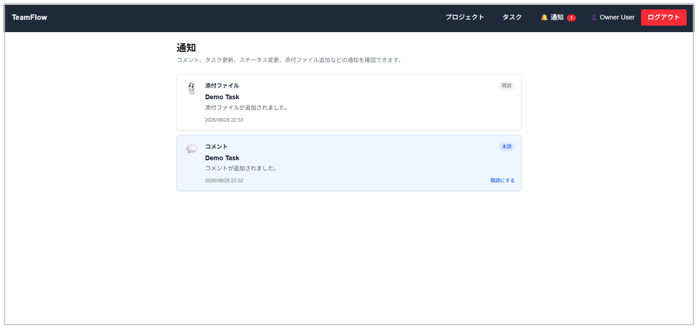
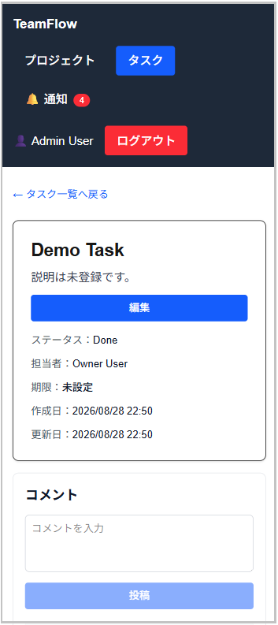

# TeamFlow Frontend

TeamFlowは、Organization単位でProjectやTaskを管理する業務管理アプリケーションです。

このリポジトリでは、TeamFlowのFrontendをNext.js / TypeScriptで実装しています。

Laravel BackendのREST APIと連携し、Project・Taskの管理を中心に、コメント、添付ファイル、通知などの業務管理機能を提供します。

また、ユーザーの権限に応じたUI制御や認証状態に応じた画面遷移、Loading・Error・Empty Stateなど、実際の業務利用を想定したUI/UXを実装しています。

## 主な機能

### 認証

Laravel Sanctumと連携したログイン・ログアウト機能を実装しています。

認証状態に応じた画面遷移や、認証切れ時のログイン画面への遷移にも対応しています。

### プロジェクト管理

Projectの作成・一覧・詳細・編集・削除に対応しています。

一覧画面ではTask数・完了数・進捗状況を確認できます。

### タスク管理

Taskの作成・一覧・詳細・編集・削除、ステータス変更に対応しています。

担当者・期限を管理でき、ProjectごとのTask確認にも対応しています。

### コメント・添付ファイル

Task詳細画面からコメントの投稿・編集・削除や、添付ファイルのアップロード・ダウンロード・削除を行えます。

### 通知

Taskやコメントなどに関するアプリ内通知を表示し、未読件数の確認や既読への変更に対応しています。

### 権限に応じたUI制御

Backendから返される権限情報を利用し、ユーザーが実行可能な操作に応じてUIの表示を制御しています。

### エラー・状態表示

Loading・Error・Empty Stateを共通UIとして実装し、データの取得状態に応じた表示を行っています。

### レスポンシブ対応

PCだけでなく画面幅の小さい環境でも操作できるよう、Headerや主要画面のレイアウトを調整しています。

## 技術スタック

| 分類                    | 技術            |
| ----------------------- | --------------- |
| Framework               | Next.js 16.2.2  |
| UI Library              | React 19.2.4    |
| Language                | TypeScript 5    |
| Data Fetching           | SWR 2.4.1       |
| CSS                     | Tailwind CSS 4  |
| Authentication          | Laravel Sanctum |
| API                     | REST API        |
| Lint                    | ESLint 9        |
| Development Environment | Docker          |
| Reverse Proxy           | Nginx           |

## フロントエンド構成

### Backend APIとの連携

Laravel BackendのREST APIと連携し、ProjectやTaskなどのデータ取得・更新を行っています。

APIへのリクエストは共通のAPIクライアントを利用し、エラー処理を共通化しています。

### 認証状態の管理

Laravel Sanctumを利用して認証を行い、認証ユーザーの取得結果をもとに画面表示や遷移を制御しています。

認証が必要な画面では、認証確認が完了するまでデータ取得を開始せず、未認証の場合はログイン画面へ遷移します。

また、セッション切れなどによってAPIから401レスポンスが返された場合も認証切れとして扱い、ログイン画面へ遷移することで、保護された画面がそのまま表示されないようにしています。

### データ取得・再検証

データ取得にはSWRを利用しています。

ProjectやTask、通知などの更新後に必要なデータを再検証し、Backendの状態と画面表示の整合性を保つようにしています。

### 権限に応じたUI制御

BackendのPolicyによる認可とFrontendのUI制御を対応させています。

Backendから返される権限情報をもとに、作成・編集・削除など、ユーザーが実行可能な操作に応じてUIを表示しています。

## 画面

### Project一覧

ProjectごとのTask数・完了数・進捗状況を確認できます。



### Task詳細

Taskのステータス・担当者・期限などの基本情報に加えて、コメントや添付ファイルを確認・操作できます。



### 通知

Taskやコメントに関する通知を一覧で確認できます。



### レスポンシブ表示

画面幅の小さい環境でも操作できるよう、主要画面のレイアウトを調整しています。



## 開発環境

TeamFlowはBackend側のDocker Compose構成から、LaravelとNext.jsを含む開発環境を起動します。

Nginxをリバースプロキシとして利用し、FrontendとBackend APIを同一ホストから利用できる構成にしています。

```text
http://laravel.test/
        │
        ├── /          → Next.js
        ├── /api/      → Laravel API
        └── /sanctum/  → Laravel Sanctum
```

## セットアップ

### 依存パッケージのインストール

Frontendディレクトリで依存パッケージをインストールします。

```bash
npm ci
```

### 環境設定

`.env.local.example`をコピーして`.env.local`を作成します。

```bash
cp .env.local.example .env.local
```

`.env.local.example`では、Backend APIの接続先を以下のように設定しています。

```env
NEXT_PUBLIC_API_URL=http://laravel.test
```

### Backendを含む開発環境のセットアップ

Dockerの起動、hosts設定、Migration / Seederなど、TeamFlow全体の開発環境のセットアップについては[TeamFlow Backend README](https://github.com/chiemi123/teamflow-backend#readme)を参照してください。

セットアップ完了後、ブラウザから以下へアクセスできます。

```text
http://laravel.test
```

## デモアカウント

Seederで作成されるDemo Organizationでは、権限の異なるアカウントでUIや操作権限の違いを確認できます。

| Role   | Email              | Password |
| ------ | ------------------ | -------- |
| Owner  | owner@example.com  | password |
| Admin  | admin@example.com  | password |
| Member | member@example.com | password |

Seederを含むセットアップ方法については[TeamFlow Backend README](https://github.com/chiemi123/teamflow-backend#readme)を参照してください。

## 今後の拡張

TeamFlow v1では、Project / Taskを中心とした業務管理機能を実装しています。

今後の拡張として、Organization管理やメンバー管理など、より本格的なチーム運用を想定した機能の追加を検討しています。
